# eLabFTW Manual

> A step‑by‑step illustrated guide for installing, configuring, and using eLabFTW and related tools on bwCloud.

<p align="center">
  
</p>

---

## Table of Contents

* [Introduction](#introduction)
* [Installing PuTTY and PuTTYgen](#installing-putty-and-puttygen)
* [Creating SSH Keys](#creating-ssh-keys)
* [Starting an Instance on bwCloud](#starting-an-instance-on-bwcloud)
* [Connecting to the Instance via PuTTY](#connecting-to-the-instance-via-putty)
* [Transferring Files (Optional)](#transferring-files-optional)
* [Installing eLabFTW](#installing-elabftw)
* [Configuring Docker and elabctl](#configuring-docker-and-elabctl)
* [Accessing eLabFTW in Browser](#accessing-elabftw-in-browser)
* [Data Storage and Backups](#data-storage-and-backups)
* [Restoring from Backup](#restoring-from-backup)
* [Troubleshooting](#troubleshooting)
* [Appendix](#appendix)

---

## Introduction

This manual provides illustrated, step‑by‑step instructions to help you deploy and manage **eLabFTW** on **bwCloud**, from creating SSH keys and instances to installing and configuring the platform.

Each section will include clear explanations, screenshots, and tips for troubleshooting common issues.

> **Note:** All screenshots and command examples will be added as the guide develops. Place them under `./docs/images/` and use relative paths to display them.

---

## Installing PuTTY and PuTTYgen

Install putty and puttygen based on the OS you have.

---

## Creating SSH Keys

The first step is to create a pair of SSH keys that will later be used to connect to the server. These keys will also be required during the instance setup, so we’ll generate them now and reuse them in the next steps.

Open PuTTYgen on your computer.

Select RSA as the key type and set 2048 bits as the key size.

Click Generate, then move your mouse pointer continuously in the blank area until the key generation completes.

<p align="center"> 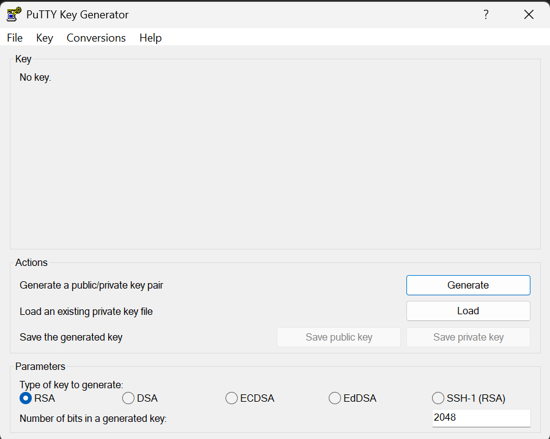 </p>

Once the key is generated, remove the default key comment and replace it with your email address.
Make sure your email address is also added at the end of the public key text shown in the box.

<p align="center"> 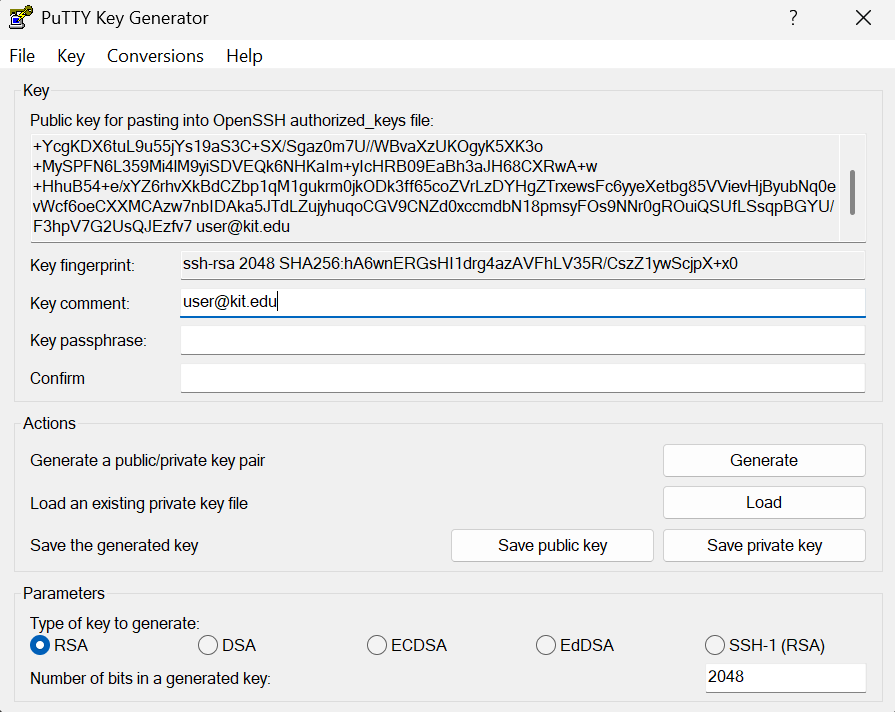 </p>

Do not close PuTTYgen yet.
Save the private key (.ppk file) with a clear name in a safe location — this file is essential for accessing your instance later.
⚠️ Important: You cannot regenerate or replace this key later; losing it means losing access to your instance.

Keep PuTTYgen open for the next step.

---

## Starting an Instance on bwCloud

To begin, open the bwCloud portal link. Click on **Dashboard** in the upper right corner, as shown below:

https://portal.bw-cloud.org/ this is the link of bwcloud

<p align="center">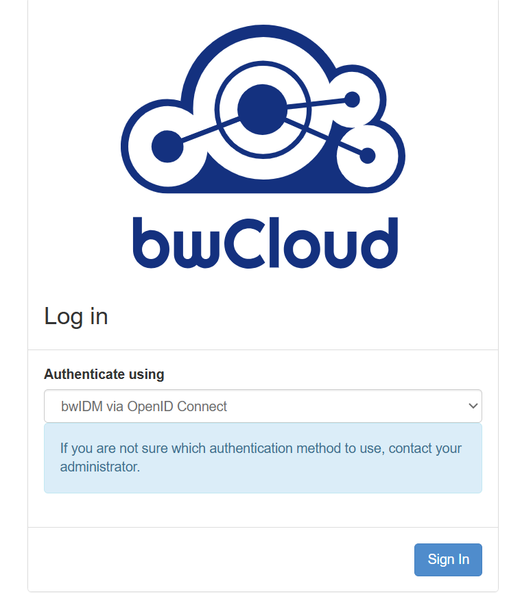</p>

Sign in and select your institute (**KIT**):

<p align="center"></p>

Enter your KIT account credentials to log in to the portal:

<p align="center">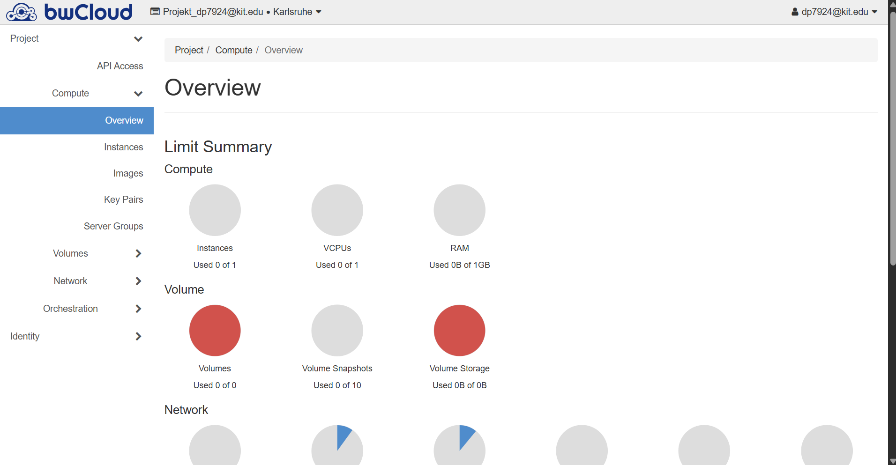</p>

Next, import the SSH key you generated with PuTTYgen. Under **Compute**, click **Key Pairs**, then select **Import Key** at the top right.

Fill in the required fields as shown below, then click **Import Key**. Your key will appear in the list.

<p align="center">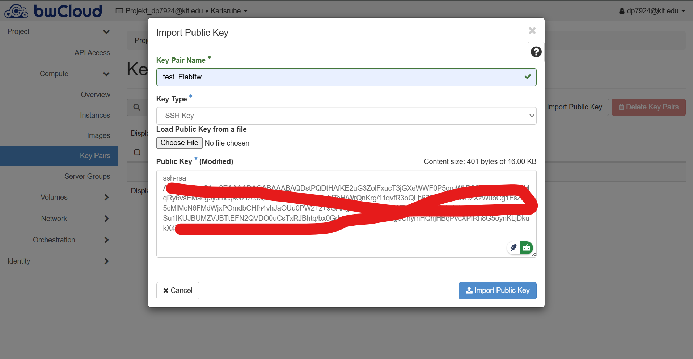</p>

Now, create a new instance. Under **Compute**, click **Instances**, then select **Launch Instance**.

<p align="center"></p>

Assign a name to your instance and click **Next**. Choose an operating system (e.g., **Ubuntu 24.04**), then click **Next**.

In the **Flavor** section, select one of the available hardware configurations.

<p align="center">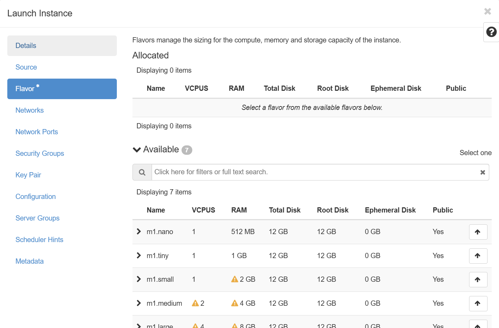</p>

Continue with the default settings until you reach the **Key Pair** section. Here, select the SSH key you imported earlier, then click **Launch Instance**.

<p align="center">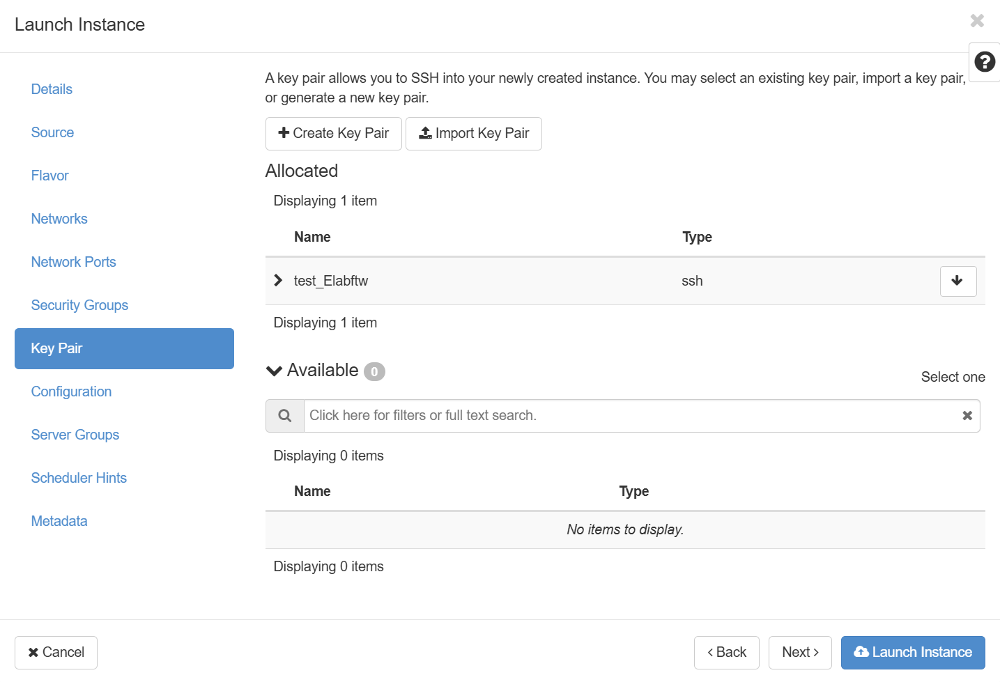</p>

After a short wait, your instance will be created. You should see it listed as shown below. Copy the instance's IP address—you will need it to connect via PuTTY in the next step.

<p align="center">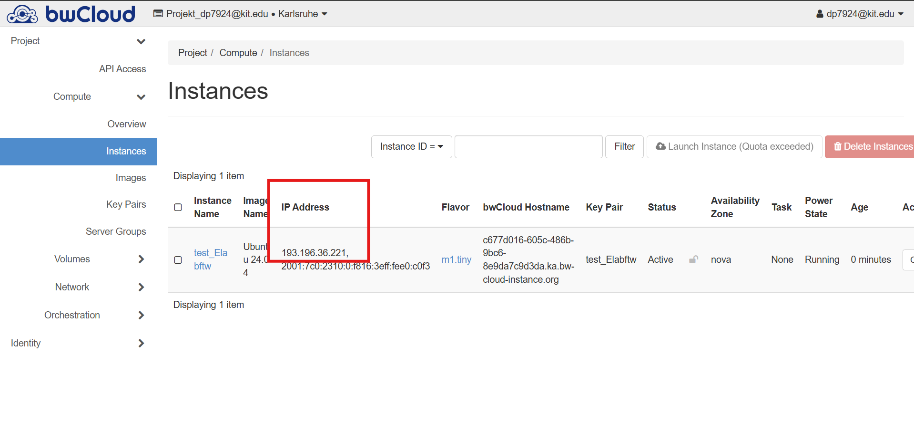</p>

---

## Connecting to the Instance via PuTTY

Open the **PuTTY** application. In the left sidebar, navigate to **Connection > SSH > Auth**. Here, you will specify your credentials as shown below:

<p align="center">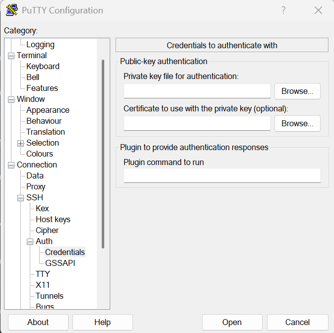</p>

Click **Browse** and select the `.ppk` private key file you saved earlier with PuTTYgen.

Next, return to the **Session** section. Enter your instance's IP address in the **Host Name (or IP address)** field. Optionally, assign a name to your session and click **Save**. Double-click your saved session to connect, as illustrated below:

<p align="center">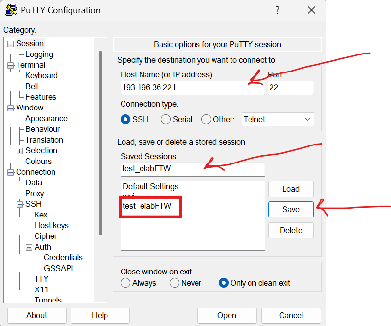</p>

If PuTTY displays a security alert, click **accept** it.

When prompted for a login name, enter `ubuntu`. You should now see the terminal window, confirming a successful connection:

<p align="center">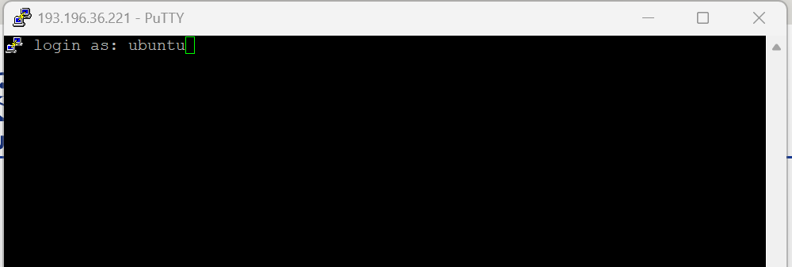</p>
<p align="center">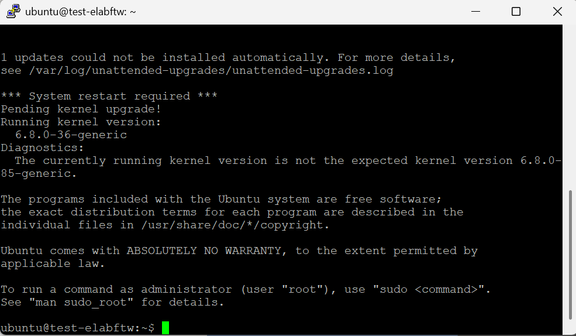</p>

---


## Installing dependencies of elabftw

To prepare your system for **eLabFTW**, you'll need to install several dependencies using **elabctl**. For detailed instructions and further documentation, refer to [the official eLabFTW documentation](https://doc.elabftw.net/).

Begin by installing `curl`, which is required for downloading files:

```bash
sudo apt update && sudo apt install -y curl
```

Verify the installation by checking the version:

```bash
curl --version
```

Next, download and install Docker Compose:

```bash
sudo curl -SL https://github.com/docker/compose/releases/download/v2.39.4/docker-compose-linux-x86_64 -o /usr/local/bin/docker-compose
```

Make Docker Compose executable:

```bash
sudo chmod +x /usr/local/bin/docker-compose
```

Create a symbolic link for easier access:

```bash
sudo ln -s /usr/local/bin/docker-compose /usr/bin/docker-compose
```

Confirm Docker Compose is installed correctly:

```bash
docker-compose --version
```

Install Docker itself:

```bash
sudo apt install -y docker.io
```

Additionally, install `dialog` and `borgbackup` for interactive dialogs and backup management:

```bash
sudo apt install -y dialog borgbackup
```

Check their installations:

```bash
dialog --version
borgbackup --version
```

## Installing eLabFTW


To install **eLabFTW** using the official installer script, run the following commands in your terminal. These commands will download the `elabctl` installer, make it executable, move it to a system-wide location, and start the installation process:

```bash
curl -sL https://get.elabftw.net -o elabctl
chmod +x elabctl
sudo mv elabctl /usr/local/bin/
elabctl install
```

The installer will guide you through the setup steps. Follow the prompts to complete the installation.

Follow the on-screen instructions to configure your eLabFTW instance.
<p align="center">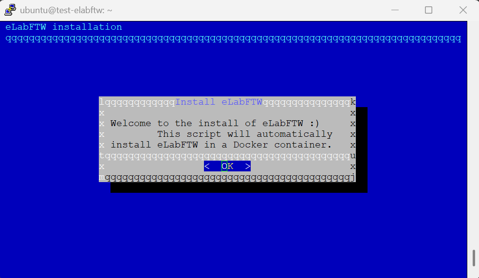</p >

<p align="center">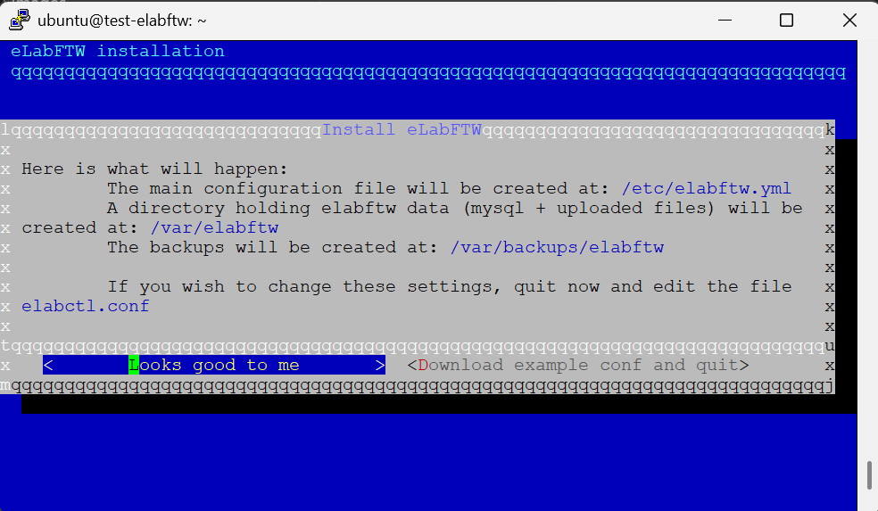</p >

Now it is time to choose if you have a domain name or if you want to use the IP address of your instance to access eLabFTW. For using the IP address, you have to choose local computer instead of a server with a domain name.

<p align="center">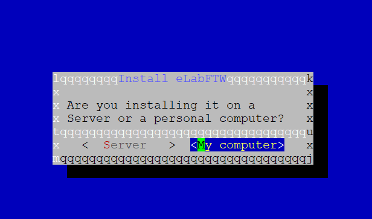</p >

## Configuring the .yml file

After the installation, it is time to configure the elabftw.yml file. for running it on your local computer keep the default settings. However it you are installing it on a server like bwCloud, you need to change the url to your IP address like shown below.

<p align="center">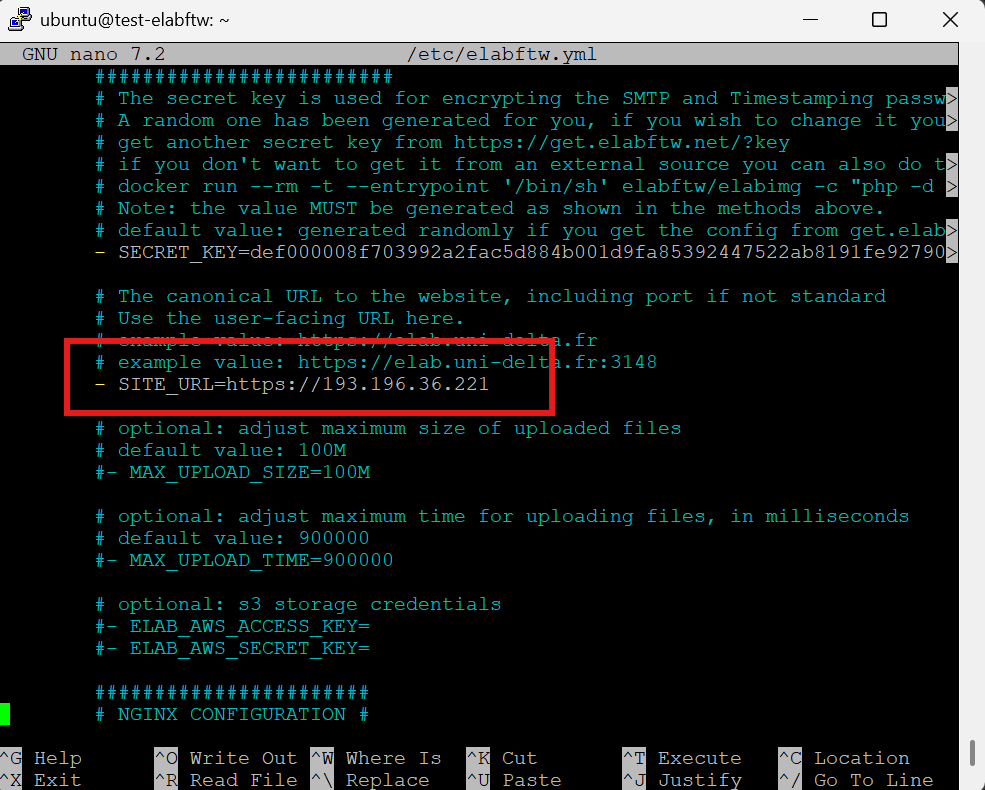</p >
then save the file and exit the editor.

Now it is time to start and initialize eLabFTW with the following command:

```bash
sudo elabctl start
sudo elabctl initialize
```
and wait until the process is finished as shown below.
<p align="center">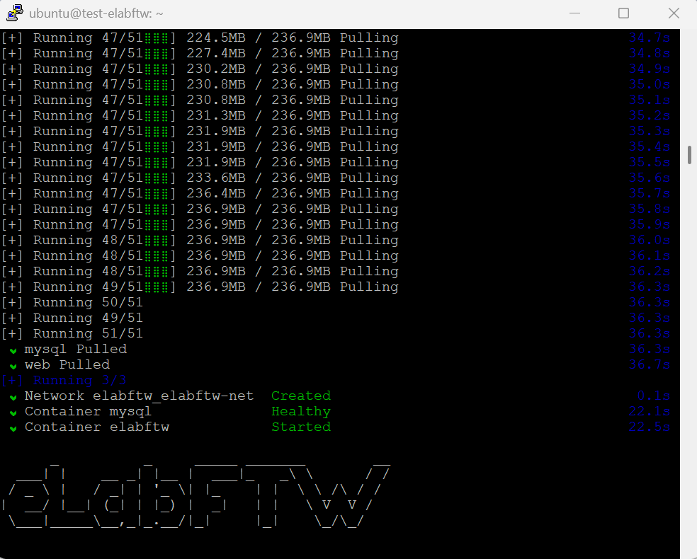</p >

keep in mind that the initialization process might take a while. Even if it shows done and healthy, it might still be in progress.
*(Content to be added later)*

---

## Accessing eLabFTW in Browser

If you set everything up correctly, you should be able to access eLabFTW in your web browser by navigating to 

`https://<your-instance-ip>` for installing on bwCloud
or 
`https://localhost` for installing on your local computer.

<p align="center">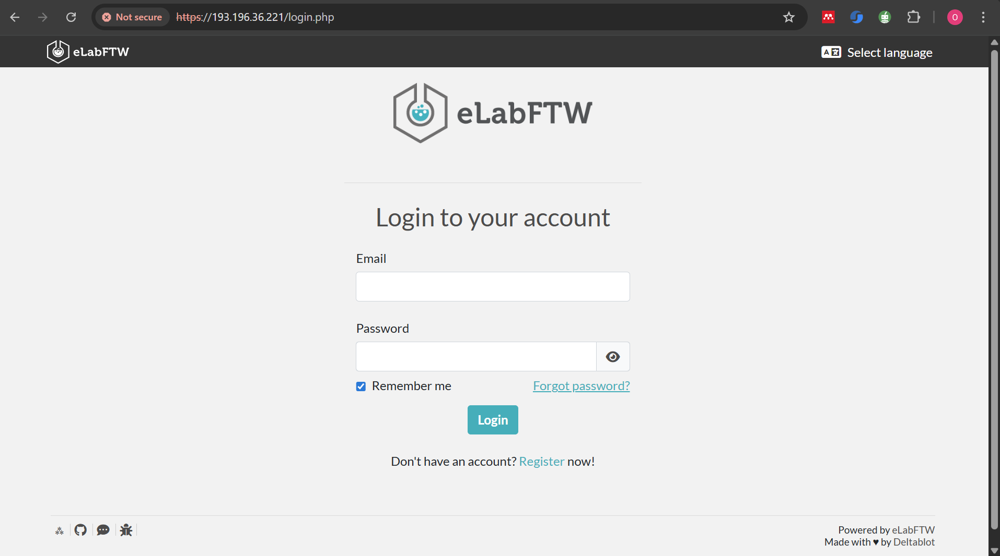</p >

---

## Data Storage and Backups

This way we create a repo and assign a passphrase key

```bash
REPO="$HOME/elabftw_borg_repo"
borg init -e repokey-blake2 "$REPO"
borg info "$REPO"
```

After running the above commands it will ask for passphrase key. enter and remember it because we need to use it in .conf file

Now it is time to create .conf file in the specific directory

```bash
sudo mkdir -p /root/.config
sudo touch /root/.config/elabctl.conf
```
and to edit it run

```bash
sudo nano /root/.config/elabctl.conf
```

And afterward it is time to set proper content for that.

Here is the file from documentation and following is 

Here are the 6 lines we used:
```bash
declare BORG_PATH="/usr/bin/borg"
declare BORG_PASSPHRASE="REPLACE_WITH_YOUR_PASSPHRASE"
declare BORG_REPO="/home/<USER>/elabftw_borg_repo"
declare BACKUP_DIR="/var/backups/elabftw"
declare CONF_FILE="/etc/elabftw.yml"
declare DATA_DIR="/var/elabftw"
```

(Replace "USER" with your actual username, and put your real passphrase.)
For the bwcloud server it is ubuntu

Also keep in mind that the data dir can be mnt or var folder based on the situation if a volume is mounted or not.

To ensure if the content of conf file is already changed run

```bash
sudo cat /root/.config/elabctl.conf
```

And now you are able to run the backup command
```bash
sudo elabctl backup
```
This will create a backup of your eLabFTW data in the Borg repository you configured.

To download the repo on youtr local computer first you need to archive it using the following command that creates a tar.gz file of the repo directory.

```bash
sudo tar -C /home/ubuntu -czf /tmp/elabftw_borg_repo-$(date +%F).tar.gz elabftw_borg_repo
```

Now to download the file on your local computer you can use putty scp or pscp command. Here is an example of using pscp command. Open the powershell and run the following command.

```shell
mkdir C:\Backups
```

```shell
"C:\Path\To\pscp.exe" -r -i "C:\Path\To\your-key.ppk" ubuntu@<SERVER_IP_OR_NAME>:/home/ubuntu/elabftw_borg_repo C:\Backups\
```


it would be also beneficial to download both .yml and .conf files to have a complete backup of your eLabFTW setup.
because they are root owned it is better to copy them first to a user owned directory and then download them.

to copy them to a user owned directory run the following commands


```bash
# copy to your home and make readable
sudo cp /root/.config/elabctl.conf /home/ubuntu/
sudo cp /etc/elabftw.yml          /home/ubuntu/
sudo chown ubuntu:ubuntu /home/ubuntu/elabctl.conf /home/ubuntu/elabftw.yml
sudo chmod 600 /home/ubuntu/elabctl.conf /home/ubuntu/elabftw.yml
```

and to download them use the same command as above but change the source path to /home/ubuntu/elabftw.yml and /home/ubuntu/elabctl.conf

for example

```shell
# download elabctl.conf
.\pscp.exe -i ".\test_Elabftw.ppk" ubuntu@193.196.36.221:/home/ubuntu/elabctl.conf .\

# download elabftw.yml
.\pscp.exe -i ".\test_Elabftw.ppk" ubuntu@193.196.36.221:/home/ubuntu/elabftw.yml .\
```
be aware that first you need to redirect to the directory you want to download the files to. And also the pscp.exe and the key file should be in the same directory or you need to provide the full path to them, if you want to run the above commands.


*(Content to be added later)*

---

## Restoring from Backup

first let us say we create a directory on the server ~/home/ named restore

```bash
mkdir -p ~/home/restore
```
And then upload all the .tar.gz file and the .yml and .conf files to that directory using pscp and following commands

```bash
# Upload individual files to ~/restore on the server
.\pscp.exe -i ".\test_Elabftw.ppk" ".\elabctl.conf" ".\elabftw.yml" ".\elabftw_borg_repo-2025-10-10.tar.gz" ubuntu@193.196.36.221:/home/ubuntu/restore/
```

Now you would be able to see the files in the restore directory

```bash
ls -l ~/home/restore
```
Now it is time to extract the .tar.gz file into a repo using the following command

```bash
sudo tar -C "$HOME/restore" -xzf "$HOME/restore/elabftw_borg_repo-2025-10-10.tar.gz"
```

and run this command to ensure its a valid borg repo

```bash
sudo env BORG_PASSPHRASE='<passphrasekey>' borg info "$HOME/restore/elabftw_borg_repo"
```
(replace <passphrasekey> with your actual passphrase key)

If it shows “Repository ID … Encrypted: Yes (repokey BLAKE2b)” and an archive name, it’s a valid Borg repo.

now it is time to set that repo as the borg repo using the follwoing commands
```bash
export BORG_REPO="$HOME/restore/elabftw_borg_repo"
export BORG_PASSPHRASE='<passphrasekey>'
sudo -E borg list
```
Note: sudo -E keeps those two env vars so Borg can read the (root-owned) repo.
(replace <passphrasekey> with your actual passphrase key)

and then we have to extract it using the following command

```bash
sudo -E borg extract "::test-elabftw-2025-10-10_14-23"
```
(replace test-elabftw-2025-10-10_14-23 with your actual archive name)

now we have to copy both .yml and .conf files to their proper locations

```bash
# Copy elabftw.yml back to its main location
sudo cp "$HOME/restore/elabftw.yml" /etc/elabftw.yml
sudo chown root:root /etc/elabftw.yml
sudo chmod 600 /etc/elabftw.yml

# Copy elabctl.conf back to its main location
sudo mkdir -p /root/.config
sudo cp "$HOME/restore/elabctl.conf" /root/.config/elabctl.conf
sudo chown root:root /root/.config/elabctl.conf
sudo chmod 600 /root/.config/elabctl.conf
```
now we move the uploaded files of the backup into the proper locations

first let us remove if the destination exists

```bash
# ensure destination exists
sudo mkdir -p /var/elabftw/web
# empty the destination (glob expands inside a root shell)
sudo bash -lc 'rm -rf /var/elabftw/web/*'

# now move the restored files in
sudo bash -lc 'mv /home/ubuntu/restore/var/elabftw/web/* /var/elabftw/web/'

# fix permissions (per doc)
sudo chown -R 101:101 /var/elabftw/web
```

Now we import the SQL database (the mysql container must be running):

first we need to cd to the directory where the sql file is located but as it is root owned we need to change to the root user

```bash
sudo -s
cd /home/ubuntu/restore/var/backups/elabftw
ls -lh
```
and now we cd into the mysql container

```bash
cd /var/backups/elabftw
```
now its time to unzip the most recent sql.gz file

```bash
gunzip mysql_dump-2025-10-10_14-23-20.sql.gz
ls -lh mysql_dump-2025-10-10_14-23-20.sql
```
(replace mysql_dump-2025-10-10_14-23-20.sql with your actual sql file name)

now we have to copy it into the mysql container, please pay attention that the mysql container must be running

to check if it is running ensure that elabctl is started and then run

```bash
docker ps
```
it should show a container with mysql name and label it as healthy

now from the folder that has the .sql dumb we have to copy it into the mysql container using the following command

```bash
docker cp mysql_dump-2025-10-10_14-23-20.sql mysql:/
```
(replace mysql_dump-2025-10-10_14-23-20.sql with your actual sql file name)
and then it has to show that it is successfully copied.

now run the following command
```bash
docker exec -it mysql bash # spawn a shell in the mysql container

```

now you need to login to mysql using the MYSQL_ROOT_PASSWORD which is available in your elabftw.yml file. Then run the following command and after entering the password you will be in the mysql prompt

```bash
mysql -u root -p
```

Thereafter you see the mysql prompt

```bash
mysql>
```

And there contunie with the following commands

```bash
Mysql> drop database elabftw; # delete the brand new database
Mysql> create database elabftw character set utf8mb4 collate utf8mb4_0900_ai_ci; # create a new one
Mysql> use elabftw; # select it
Mysql> set names utf8mb4; # make sure you import in utf8 (don't do this if you are in latin1)
Mysql> source mysql_dump-YYYY-MM-DD.sql; # import the backup file (replace with your actual sql file name)
Mysql> exit; # exit mysql
```

Now you can exit from the mysql container and also from the root user

```bash
exit
```
You are all set now.
```bash

## Appendix

Additional resources, references, and external documentation links will be added here.

---

> **Next step:** You can now start adding the written content and screenshots section by section. I’ll help format and illustrate them as you provide each part.

